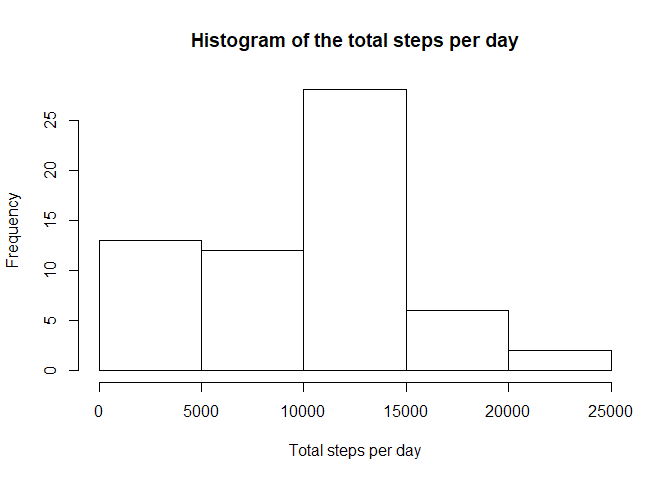
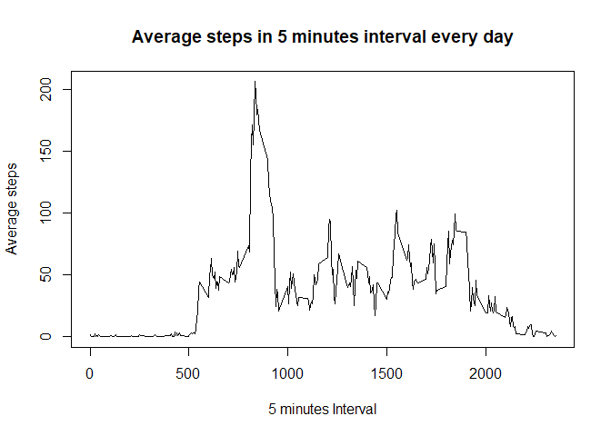
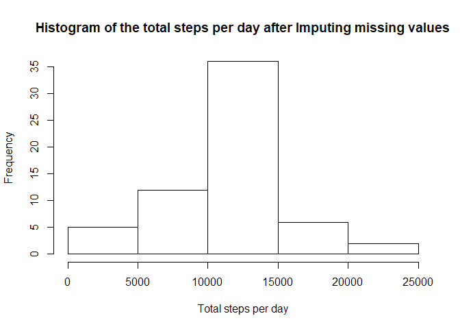
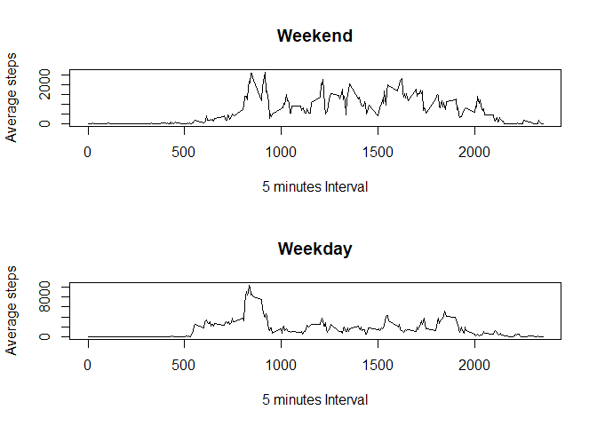

## Loading and preprocessing the data
First we will need to include a useful libarary and export figures by default into figures folder

```r
library(dplyr)
knitr::opts_chunk$set(fig.path = 'figures/')
```

Then we will download the data and assigne them to the dataset variable


```r
download.file("https://d396qusza40orc.cloudfront.net/repdata/data/activity.zip",destfile = "data.zip")
unzip("data.zip")
dataset <- read.csv("activity.csv")
```

We will transform the date column into a Date data type


```r
dataset$date <- as.Date(dataset$date, "%Y-%m-%d")
```

## What is mean total number of steps taken per day?

1. Calculate the total number of steps taken per day
2. If you do not understand the difference between a histogram and a barplot, research the difference between them. Make a histogram of the total number of steps taken each day
3. Calculate and report the mean and median of the total number of steps taken per day


```r
totalnumberofstepsperday <- group_by(dataset,date) %>%
  summarise(totalsteps = sum(steps, na.rm = TRUE))

print(totalnumberofstepsperday, n = nrow(totalnumberofstepsperday))
```

```
## # A tibble: 61 x 2
##    date       totalsteps
##    <date>          <int>
##  1 2012-10-01          0
##  2 2012-10-02        126
##  3 2012-10-03      11352
##  4 2012-10-04      12116
##  5 2012-10-05      13294
##  6 2012-10-06      15420
##  7 2012-10-07      11015
##  8 2012-10-08          0
##  9 2012-10-09      12811
## 10 2012-10-10       9900
## 11 2012-10-11      10304
## 12 2012-10-12      17382
## 13 2012-10-13      12426
## 14 2012-10-14      15098
## 15 2012-10-15      10139
## 16 2012-10-16      15084
## 17 2012-10-17      13452
## 18 2012-10-18      10056
## 19 2012-10-19      11829
## 20 2012-10-20      10395
## 21 2012-10-21       8821
## 22 2012-10-22      13460
## 23 2012-10-23       8918
## 24 2012-10-24       8355
## 25 2012-10-25       2492
## 26 2012-10-26       6778
## 27 2012-10-27      10119
## 28 2012-10-28      11458
## 29 2012-10-29       5018
## 30 2012-10-30       9819
## 31 2012-10-31      15414
## 32 2012-11-01          0
## 33 2012-11-02      10600
## 34 2012-11-03      10571
## 35 2012-11-04          0
## 36 2012-11-05      10439
## 37 2012-11-06       8334
## 38 2012-11-07      12883
## 39 2012-11-08       3219
## 40 2012-11-09          0
## 41 2012-11-10          0
## 42 2012-11-11      12608
## 43 2012-11-12      10765
## 44 2012-11-13       7336
## 45 2012-11-14          0
## 46 2012-11-15         41
## 47 2012-11-16       5441
## 48 2012-11-17      14339
## 49 2012-11-18      15110
## 50 2012-11-19       8841
## 51 2012-11-20       4472
## 52 2012-11-21      12787
## 53 2012-11-22      20427
## 54 2012-11-23      21194
## 55 2012-11-24      14478
## 56 2012-11-25      11834
## 57 2012-11-26      11162
## 58 2012-11-27      13646
## 59 2012-11-28      10183
## 60 2012-11-29       7047
## 61 2012-11-30          0
```

```r
hist(
  totalnumberofstepsperday$totalsteps, 
  xlab = "Total steps per day",
  main = "Histogram of the total steps per day"
  )
```

<!-- -->

```r
meantotalstepsperday <- mean(totalnumberofstepsperday$totalsteps)
mediantotalstepsperday <- median(totalnumberofstepsperday$totalsteps)
```
The mean total steps per day is 9354.2295082 and the median is 10395 


## What is the average daily activity pattern?
1. Make a time series plot (i.e. type = "l") of the 5-minute interval (x-axis) and the average number of steps taken, averaged across all days (y-axis)
2. Which 5-minute interval, on average across all the days in the dataset, contains the maximum number of steps?


```r
averagenumberofstepsperinterval <- group_by(dataset, interval) %>%
  summarise(averagesteps = mean(steps, na.rm = TRUE))

plot(
  averagenumberofstepsperinterval$interval,
  averagenumberofstepsperinterval$averagesteps,
  type ="l",
  xlab = "5 minutes Interval",
  ylab = "Average steps",
  main = "Average steps in 5 minutes interval every day"
  )
```

<!-- -->

```r
maximumintervalsteps <- arrange(averagenumberofstepsperinterval, desc(averagesteps))[1,1]
```

The maximum interval average steps is 835 


## Imputing missing values
Note that there are a number of days/intervals where there are missing values (coded as NA). The presence of missing days may introduce bias into some calculations or summaries of the data.

1. Calculate and report the total number of missing values in the dataset (i.e. the total number of rows with NAs)
2. Devise a strategy for filling in all of the missing values in the dataset. The strategy does not need to be sophisticated. For example, you could use the mean/median for that day, or the mean for that 5-minute interval, etc.
3. Create a new dataset that is equal to the original dataset but with the missing data filled in.
4. Make a histogram of the total number of steps taken each day and Calculate and report the mean and median total number of steps taken per day. Do these values differ from the estimates from the first part of the assignment? What is the impact of imputing missing data on the estimates of the total daily number of steps?


```r
countofrowswithNA <- sum(!complete.cases(dataset))
```
Total rows with missing values in them: 2304


```r
averagenumberofstepsperinterval <- group_by(dataset, interval) %>%
  summarise(averagesteps = mean(steps, na.rm = TRUE))
averagenumberofstepsperday <- group_by(dataset, date) %>%
  summarise(averagesteps = mean(steps, na.rm = TRUE))

missedvaluereplaceddataset <- mutate(dataset,steps=steps)


missedvaluereplaceddataset[is.na(missedvaluereplaceddataset$steps),]$steps <- averagenumberofstepsperday[averagenumberofstepsperday$date %in% missedvaluereplaceddataset[is.na(missedvaluereplaceddataset$steps),]$date, ]$averagesteps

missedvaluereplaceddataset[is.na(missedvaluereplaceddataset$steps),]$steps <- averagenumberofstepsperinterval[averagenumberofstepsperinterval$interval %in% missedvaluereplaceddataset[is.na(missedvaluereplaceddataset$steps),]$interval, ]$averagesteps


missedvaluereplaceddatasetgroupedbydate <- group_by(missedvaluereplaceddataset, date) %>%
  summarise(
    totalsteps = sum(steps, na.rm = TRUE),
    meansteps = mean(steps, na.rm = TRUE),
    mediansteps = median(steps, na.rm = TRUE)
    )

hist(
  missedvaluereplaceddatasetgroupedbydate$totalsteps, 
  xlab = "Total steps per day",
  main = "Histogram of the total steps per day after Imputing missing values"
  )
```

<!-- -->

```r
meantotalstepsperday <- mean(missedvaluereplaceddatasetgroupedbydate$totalsteps)
mediantotalstepsperday <- median(missedvaluereplaceddatasetgroupedbydate$totalsteps)
```

The mean total steps per day is 1.0766189\times 10^{4} and the median is 1.0766189\times 10^{4} 


## Are there differences in activity patterns between weekdays and weekends?

Are there differences in activity patterns between weekdays and weekends?

For this part the weekdays() function may be of some help here. Use the dataset with the filled-in missing values for this part.

1. Create a new factor variable in the dataset with two levels – “weekday” and “weekend” indicating whether a given date is a weekday or weekend day.
2. Make a panel plot containing a time series plot (i.e. type = "l") of the 5-minute interval (x-axis) and the average number of steps taken, averaged across all weekday days or weekend days (y-axis). See the README file in the GitHub repository to see an example of what this plot should look like using simulated data.


```r
missedvaluereplaceddatasetwithdaystype <- mutate(
  missedvaluereplaceddataset, 
  day = case_when(
    weekdays(date) %in% c("Saturday", "Sunday") ~ "Weekend",
    TRUE ~ "Weekday"
  )
  ) %>%
  group_by(day, interval) %>%
  summarise(
    totalsteps = sum(steps, na.rm = TRUE)
    )

weekendset <- filter(missedvaluereplaceddatasetwithdaystype, day == "Weekend")
weekdayset <- filter(missedvaluereplaceddatasetwithdaystype, day == "Weekday")

par(mfrow = c(2,1))

plot(
  weekendset$interval,
  weekendset$totalsteps,
  type="l",
  main = "Weekend",
  xlab = "5 minutes Interval",
  ylab = "Average steps"
)

plot(
  weekdayset$interval,
  weekdayset$totalsteps,
  type="l",
  main = "Weekday",
  xlab = "5 minutes Interval",
  ylab = "Average steps"
  )
```

<!-- -->

